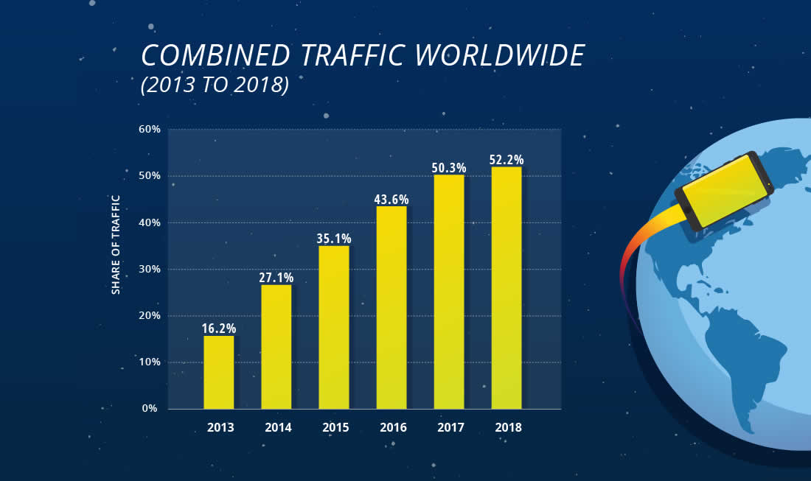

## Progression
  1. Dataset acquired from Kaggle search
  2. Exploratory data analysis has been performed
  3. Linear Assumptions have been tested
  4. Model is built and ridge regularization has been performed
  5. **The findings have been presented**

## Introduction
Like many people, iPhone 3Gs was the first smartphone I've ever purchased. It was indeed revolutionary, but it was never my go-to device for web surfing; the screen was small and functions were much limited compared to a PC or Mac. Fast-forwarding 11 years, my surfing habit did not change drastically despite a miraculous increase in the computing power on mobile devices. That's why I was perplexed when came across the following chart:

The chart above alleges that worldwide internet traffic is comprised of more mobile devices than conventional PC/Mac. My immediate reaction was 'that can't be right.' Then, I became more curious about exploring what people do on their smartphone; the web traffic's only one component of smartphone usage. One question led to another, and naturally, I arrived at data sciency question: what Apps do they use, and would it be possible to assemble a model that predict the number of installs given features?

Let's find out.

## Datasets
Google Play Store dataset from Kaggle(credit: Lavanya Gupta)
- googleplaystore.csv
- googleplaystore_user_reviews.csv

link: https://www.kaggle.com/lava18/google-play-store-apps

## Metrics to consider: googleplaystore_user_reviews.csv
Most metrics in this model is intuitive. The reviews dataset, however, needs a little guidance.

The dataset is composed of '100 most relevant reviews from the play store,' according to its author. Along with the actual review, preprocessed NLP measures are included. The two metrics being utilized for the sake of my search are sentiment polarity and sentiment subjectivity. The following are the definitions borrowed from Alice Zhao's lecture on Natural Language Processing.

* Sentiment Polarity: how positive, or negative, a word is. -1 is very negative. +1 is very positive.
* Sentiment Subjectivity: how subjective, or opinionated a word is. 0 is a fact and 1 is very much opinion.

Furthermore, 'delta' has been added as an engineered feature, which measures the days since the last update.

## Methodology
After cleaning and modifying features, the assumptions of linear regression were checked using the following:
* Pair plot: Linearity
* QQ plot: Normality
* Scatter plot: Homoscedasticity
* Heatmap: Multi-collinearity

Once done, regression models were built using two libraries (sklearn and statsmodel) and three regularizations were applied (Ridge, Lasso, and Elastic Net).

## Findings
The initial model built with engineered featured performed well, at R-squared value of .826 and adjusted R-squared of .824. Also, the difference in root mean squared error between train and test was minuscule and regularizations performed seemed to validate the accuracy of the model.

However, where this model falls short is in its very features. One of the features that was weighted heavily according to its coefficient was the Box-cox transformation of the number of reviews. Of course, there will be more reviews when the number of installs is high! *ARRRGGH.*

Although this project was a very fruitful experience, I was a little disappointed in my failure to foresee this fatal flaw.

## Sources
- Lavanya Gupta *Google Play Store Apps web scraped data of 10k Play Store apps* https://www.kaggle.com/lava18/google-play-store-apps
- *Mobile vs. Desktop Usage* https://www.broadbandsearch.net/blog/mobile-desktop-internet-usage-statistics
- Alice Zhao - *Natural Language Processing in Python* https://github.com/adashofdata/nlp-in-python-tutorial

